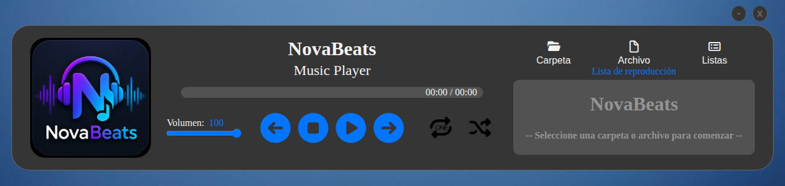
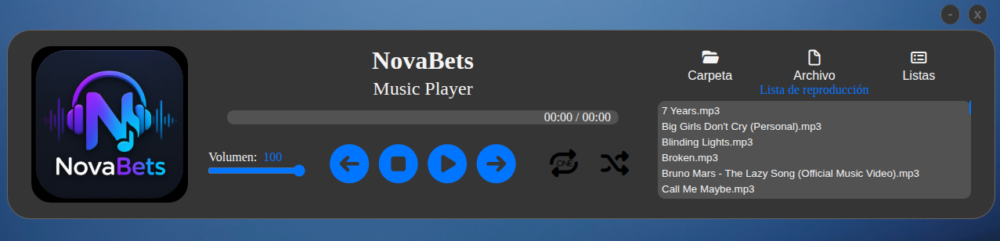
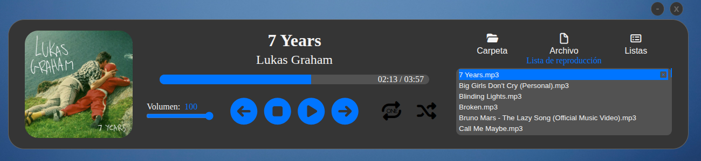

# NovaBets

Reproductor de música local para Linux desarrollado con Electron.

## Estado del proyecto

**Versión actual:** 1.2.0

NovaBets es una aplicación funcional y apta para uso diario. Actualmente se encuentra en fase beta, por lo que pueden existir errores no detectados.

Los reportes de errores, sugerencias y comentarios son bienvenidos.

---

## Capturas de pantalla

### Pantalla principal

<!-- Reemplazar por la captura principal de la aplicación -->



### Playlist cargada

<!-- Reemplazar por una captura mostrando una playlist con varias canciones -->



### Información de la pista

<!-- Reemplazar por una captura donde se vean los metadatos o la carátula -->



---

## Descripción

NovaBets es un reproductor de música local orientado a usuarios que prefieren gestionar su propia biblioteca musical sin depender de servicios de streaming.

Permite cargar carpetas de audio, gestionar playlists personalizadas y reproducir música mediante una interfaz sencilla desarrollada con tecnologías web modernas.

El proyecto fue creado como parte de mi proceso de aprendizaje en desarrollo web Full Stack, aplicando JavaScript moderno, manipulación del DOM, almacenamiento local y desarrollo de aplicaciones de escritorio con Electron.

---

## Características

### Reproducción de audio

- Reproducción de archivos de audio locales.
- Carga automática de carpetas musicales.
- Navegación entre canciones.
- Reproducción automática de la siguiente pista.
- Modo aleatorio (Shuffle).
- Modo repetición.

### Gestión de playlists

- Creación de playlists personalizadas.
- Guardado de playlists mediante almacenamiento local.
- Selección de playlists guardadas.
- Eliminación de playlists almacenadas.
- Cambio rápido entre la playlist actual y playlists guardadas.

### Interfaz y experiencia de usuario

- Controles de reproducción:
  - Play
  - Pause
  - Next
  - Previous
  - Repeat
  - Shuffle
- Control de volumen.
- Persistencia de configuraciones entre sesiones.
- Interfaz desarrollada con HTML, CSS y JavaScript.

### Información musical

- Lectura de metadatos de archivos de audio.
- Visualización de información de las pistas.
- Visualización de carátulas cuando están disponibles.

---

## Tecnologías utilizadas

- JavaScript
- HTML5
- CSS3
- Electron
- Node.js
- music-metadata

---

## Instalación para desarrollo

Clonar el repositorio:

```bash
git clone https://github.com/Alejandro-Elias/novabets.git
cd novabets
```

Instalar dependencias:

```bash
npm install
```

Ejecutar la aplicación:

```bash
npm start
```

---

## Generar build

```bash
npm run build
```

Los paquetes generados se almacenan en:

```text
dist/
```

---

## Estructura del proyecto

```text
src/
├── main.js
├── index.html
├── renderer/
│   ├── buttons/
│   │   ├── play.js
│   │   ├── cerrar.js
│   │   ├── minimizar.js
│   │   ├── stop.js
│   │   └── play/
│   │       ├── loadList.js
│   │       ├── next.js
│   │       └── previous.js
│   ├── cargarPlaylist.js
│   ├── currentTrack.js
│   ├── eliminarPlaylist.js
│   ├── eliminarTrack.js
│   ├── files.js
│   ├── folder.js
│   ├── getData.js
│   ├── getMetadatos.js
│   ├── guardarPlaylist.js
│   ├── indexCurrent.js
│   ├── listMetadatos.js
│   ├── mostrarDatos.js
│   ├── mostrarLista.js
│   ├── repeat.js
│   ├── resaltarTrack.js
│   ├── SelectItemPlaylist.js
│   ├── selectPlaylist.js
│   ├── setTrack.js
│   ├── tiempos.js
│   └── volumen.js
├── modules/
│   ├── localStorage.js
│   ├── preload.js
│   ├── renderer.js
│   ├── suffle.js
│   └── ipc/
│       ├── createWindow.js
│       ├── registerIpc.js
│       ├── registerIpcBack.js
│       ├── seleccionarArchivo.js
│       └── seleccionarCarpeta.js
├── css/
│   ├── controls.css
│   ├── cover.css
│   ├── data.css
│   ├── playlistZone.css
│   └── style.css
└── assets/
    ├── fontAwesome/
    │   └── webfonts/
    │       └── all.min.css
    └── images/
```

> La estructura está organizada para mantener una separación clara entre componentes renderer, módulos reutilizables, estilos y activos.

---

## Próximos objetivos

- Personalización de la interfaz.
- Mejoras adicionales de rendimiento.
- Mejoras en la experiencia de usuario.
- Nuevas herramientas para organización de bibliotecas musicales.
- Soporte para nuevas funcionalidades relacionadas con playlists.
- Publicación y distribución mediante Flatpak.

---

## Feedback

Si encuentras errores o tienes sugerencias, puedes abrir un Issue en GitHub.

Todo feedback es bienvenido y ayuda a mejorar el proyecto.

---

## Autor

**Alejandro Elias**

Desarrollador Web Full Stack

---

Proyecto desarrollado como práctica de programación y aprendizaje de tecnologías web modernas aplicadas al desarrollo de aplicaciones de escritorio.
